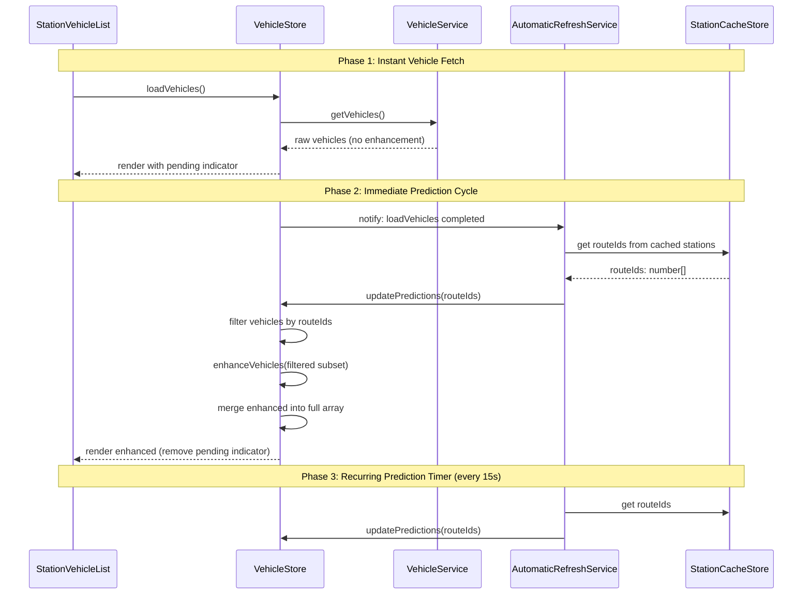

# Technical Design: Enhancement Scope Reduction

## Overview

This design eliminates the 6-second blocking computation in `vehicleService.getVehicles()` by splitting vehicle fetching from position prediction enhancement. Vehicles are returned immediately with raw GPS data, and enhancement runs asynchronously on only the 2–5 vehicles matching the user's station routes — triggered immediately after fetch and then every 15 seconds.

## Architecture



## Components and Interfaces

### 1. VehicleService (Simplified)

**File:** `src/services/vehicleService.ts`

The service becomes a thin fetch layer. It no longer loads trips, stations, shapes, or stop times, and no longer calls `enhanceVehicles()`.

```typescript
// vehicleService.ts — simplified getVehicles
export const vehicleService = {
  async getVehicles(): Promise<EnhancedVehicleData[]> {
    const rawVehicles = await this.getRawVehicles();

    // Convert to EnhancedVehicleData shape without predictions
    return rawVehicles.map(vehicle => ({
      ...vehicle,
      latitude: vehicle.latitude,   // raw GPS — no prediction
      longitude: vehicle.longitude, // raw GPS — no prediction
      apiLatitude: vehicle.latitude,
      apiLongitude: vehicle.longitude,
      apiSpeed: vehicle.speed,
      predictionMetadata: undefined, // signals "not yet enhanced"
    }));
  },
  // getRawVehicles() remains unchanged
};
```

**Key change:** Removes `Promise.all([loadTrips, loadStops, loadShapes, loadStopTimes])` and `enhanceVehicles()` call. The supplementary data loading remains the responsibility of `updatePredictions` in the store.

### 2. VehicleStore (Route-Scoped Predictions)

**File:** `src/stores/vehicleStore.ts`

`updatePredictions` gains a `routeIds` parameter and only enhances the matching subset.

```typescript
interface VehicleStore {
  // ... existing fields ...
  updatePredictions: (routeIds: number[]) => Promise<void>;
}
```

```typescript
updatePredictions: async (routeIds: number[]) => {
  const currentState = get();

  if (currentState.vehicles.length === 0) return;
  if (routeIds.length === 0) return; // no-op for empty scope

  // Staleness guard remains
  const maxStaleTime = API_DATA_STALENESS_THRESHOLDS.VEHICLES;
  if (currentState.lastApiFetch && (Date.now() - currentState.lastApiFetch) > maxStaleTime) {
    return;
  }

  // Filter to only route-scoped vehicles
  const routeIdSet = new Set(routeIds);
  const scopedVehicles = currentState.vehicles.filter(
    v => v.route_id != null && routeIdSet.has(v.route_id)
  );

  if (scopedVehicles.length === 0) return;

  // Load enhancement data from stores (trips, stations, shapes, stopTimes)
  // ... existing store imports and lookup building ...

  // Reset positions to raw API values before re-enhancing
  const originalVehicles = scopedVehicles.map(v => ({
    ...v,
    latitude: v.apiLatitude,
    longitude: v.apiLongitude,
  }));

  const enhanced = enhanceVehicles(originalVehicles, { routeShapes, stopTimesByTrip, stops });

  // Merge: replace enhanced vehicles in the full array, leave others untouched
  const enhancedById = new Map(enhanced.map(v => [v.id, v]));
  const merged = currentState.vehicles.map(v => enhancedById.get(v.id) ?? v);

  set({ vehicles: merged, error: null, lastUpdated: Date.now() });
},
```

**Key changes:**
- Accepts `routeIds: number[]` parameter
- Filters vehicles by `route_id` membership in `routeIds`
- Enhances only the filtered subset
- Merges enhanced vehicles back by ID, leaving non-scoped vehicles unchanged
- Uses `lastApiFetch` (not `lastUpdated`) for staleness check so prediction cycles don't reset the staleness clock

### 3. AutomaticRefreshService (Route Context + Immediate Trigger)

**File:** `src/services/automaticRefreshService.ts`

Two changes:
1. Pass `routeIds` to `updatePredictions` obtained from the station cache
2. Trigger an immediate prediction cycle after vehicle fetch completes

```typescript
private getRouteIdsFromCache(): number[] {
  const stationCacheStore = useStationCacheStore.getState();
  // Get the most recent cache entry's stations
  for (const [, entry] of stationCacheStore.cache) {
    if (Date.now() - entry.timestamp < 5 * 60 * 1000) {
      // Collect all routeIds from filtered stations
      const routeIds = entry.stations.flatMap(s => s.routeIds);
      return [...new Set(routeIds)];
    }
  }
  return []; // No valid cache — predictions skipped
}

private async updatePredictionsOnly(): Promise<void> {
  const routeIds = this.getRouteIdsFromCache();
  const { useVehicleStore } = await import('../stores/vehicleStore');
  await useVehicleStore.getState().updatePredictions(routeIds);
}
```

**Immediate first prediction cycle:**

After `loadVehicles` completes, the store emits a state change (`loading: false`, `vehicles.length > 0`). The `AutomaticRefreshService` subscribes to this transition and triggers an immediate prediction cycle:

```typescript
private setupImmediatePredictionTrigger(): void {
  // Subscribe to vehicle store state changes
  const { useVehicleStore } = await import('../stores/vehicleStore');
  this.vehicleLoadUnsubscribe = useVehicleStore.subscribe(
    (state, prevState) => {
      // Detect: was loading, now loaded with vehicles
      if (prevState.loading && !state.loading && state.vehicles.length > 0) {
        this.triggerImmediatePrediction();
      }
    }
  );
}

private async triggerImmediatePrediction(): Promise<void> {
  // Reset the prediction timer so the next tick is 15s from now
  this.stopPredictionUpdateTimer();

  if (!this.isPredicting) {
    this.isPredicting = true;
    try {
      await this.updatePredictionsOnly();
    } finally {
      this.isPredicting = false;
    }
  }

  // Restart the regular 15s timer from this point
  if (this.isAppInForeground) {
    this.startPredictionUpdateTimer();
  }
}
```

### 4. StationVehicleList (Pending Indicator)

**File:** `src/components/features/lists/StationVehicleList.tsx`

A vehicle is considered "pending enhancement" when `predictionMetadata` is `undefined` (the field set by `enhanceVehicles`). The component renders a subtle indicator on pending vehicle cards.

```typescript
// In VehicleCard component
const isPendingEnhancement = !vehicle.predictionMetadata;

// Render a subtle pulsing dot or skeleton overlay
{isPendingEnhancement && (
  <Box
    sx={{
      position: 'absolute',
      top: 8,
      right: 8,
      width: 8,
      height: 8,
      borderRadius: '50%',
      bgcolor: 'info.main',
      opacity: 0.6,
      animation: 'pulse 1.5s ease-in-out infinite',
      '@keyframes pulse': {
        '0%, 100%': { opacity: 0.6, transform: 'scale(1)' },
        '50%': { opacity: 0.3, transform: 'scale(1.2)' },
      },
    }}
  />
)}
```

**Design decision:** A small pulsing dot in the card corner is non-intrusive — it doesn't block any content and disappears after the first prediction cycle (~1s). No layout shift occurs because it's absolutely positioned.

## Interfaces

### Updated `VehicleStore` Interface

```typescript
interface VehicleStore {
  vehicles: EnhancedVehicleData[];
  loading: boolean;
  error: string | null;
  lastUpdated: number | null;
  lastApiFetch: number | null;

  loadVehicles: () => Promise<void>;
  refreshData: () => Promise<void>;
  updatePredictions: (routeIds: number[]) => Promise<void>; // NEW: accepts routeIds
  clearVehicles: () => void;
  clearError: () => void;
  isDataFresh: (maxAgeMs?: number) => boolean;
}
```

### Updated `vehicleService` Interface

```typescript
export const vehicleService = {
  getVehicles(): Promise<EnhancedVehicleData[]>; // Returns unenhanced vehicles in EnhancedVehicleData shape
  getRawVehicles(): Promise<TranzyVehicleResponse[]>; // Unchanged
};
```

### Helper Method on AutomaticRefreshService

```typescript
class AutomaticRefreshService {
  // NEW methods
  private getRouteIdsFromCache(): number[];
  private setupImmediatePredictionTrigger(): void;
  private triggerImmediatePrediction(): Promise<void>;
  // Existing methods unchanged
}
```

## Data Models

### EnhancedVehicleData (Unchanged)

The `EnhancedVehicleData` interface remains unchanged. The key fields relevant to this feature:

```typescript
interface EnhancedVehicleData extends TranzyVehicleResponse {
  latitude: number;          // Raw GPS or predicted (after enhancement)
  longitude: number;         // Raw GPS or predicted (after enhancement)
  speed: number;             // Raw or predicted speed
  apiLatitude: number;       // Always raw GPS
  apiLongitude: number;      // Always raw GPS
  apiSpeed: number;          // Always raw speed
  predictionMetadata?: {     // undefined = not yet enhanced
    positionMethod: 'route_shape' | 'fallback';
    positionApplied: boolean;
    predictedSpeed: number;
    speedMethod: string;
    speedConfidence: string;
    speedApplied: boolean;
    // ... other fields
  };
}
```

### Enhancement State

No new types needed. Enhancement state is derived from the existing `predictionMetadata` field:

| Field | Unenhanced | Enhanced |
|-------|-----------|----------|
| `predictionMetadata` | `undefined` | `{ positionApplied: true, ... }` |
| `latitude` | `=== apiLatitude` | Predicted value |
| `longitude` | `=== apiLongitude` | Predicted value |

## Data Flow

### Enhancement State Detection

A vehicle's enhancement state is determined by the presence of `predictionMetadata`:

| State | `predictionMetadata` | `latitude`/`longitude` |
|-------|---------------------|----------------------|
| Unenhanced (pending) | `undefined` | Raw GPS values (= `apiLatitude`/`apiLongitude`) |
| Enhanced | Object with prediction data | Predicted values |

### Merge Strategy

After enhancement, the store merges by vehicle `id`:

```
vehicles.map(v => enhancedById.get(v.id) ?? v)
```

This ensures:
- Enhanced vehicles get updated predictions
- Non-scoped vehicles retain their current state (raw or previously enhanced)
- Array order is preserved (no re-sorting)

## Error Handling

| Scenario | Behavior |
|----------|----------|
| `getVehicles()` API failure | Existing error handling preserved — sets `error` state, shows error UI |
| `updatePredictions()` fails (store data missing) | Logs warning, vehicles remain in current state (unenhanced or stale enhanced) |
| Station cache empty/stale | `getRouteIdsFromCache()` returns `[]` → predictions skipped, no error |
| Enhancement throws for subset | `try/catch` in `updatePredictions` prevents crash, logs warning |
| Immediate trigger fires before store data available | `updatePredictions` early-returns if trips/stops are empty |

## Performance Considerations

- **Before:** `getVehicles()` loads 4 supplementary datasets + enhances ~420 vehicles = ~6s blocking
- **After:** `getVehicles()` is a single API call (~200ms), enhancement runs on 2–5 vehicles (~10ms)
- Supplementary data (trips, stops, shapes, stopTimes) is only loaded when `updatePredictions` first runs — cached by their respective stores with 24h TTL
- The `Set`-based route filtering is O(n) over vehicles, negligible for ~420 items
- Merge by Map lookup is O(n), no performance concern

## Testing Strategy

### Property-Based Tests (fast-check, min 100 runs)

Located at `src/test/services/vehicleService.property.test.ts` and `src/test/stores/vehicleStore.property.test.ts`:

1. **Raw Field Preservation** — Generate random `TranzyVehicleResponse[]`, call the simplified `getVehicles` mapping, verify all api* fields match originals and latitude/longitude are unmodified.
2. **Route-Scoped Filtering** — Generate random vehicles with various `route_id` values and random `routeIds` subsets. Verify only matching vehicles reach `enhanceVehicles`.
3. **Merge Correctness** — Generate a vehicle array and a routeIds subset. After mock enhancement, verify scoped vehicles are updated while non-scoped vehicles are unchanged.
4. **Pending Indicator Correlation** — Generate vehicle objects with and without `predictionMetadata`. Verify rendering logic correctly toggles the indicator.

### Unit Tests (example-based)

Located at `src/test/services/vehicleService.test.ts` and `src/test/stores/vehicleStore.test.ts`:

- `getVehicles` does not call `enhanceVehicles` (mock verification)
- `getVehicles` does not load trips/stations/shapes/stopTimes
- `updatePredictions([])` is a no-op
- Immediate prediction trigger fires after `loadVehicles` completes
- `getRouteIdsFromCache()` returns empty array when cache is stale/empty
- Timer restarts after immediate prediction cycle

## Correctness Properties

*A property is a characteristic or behavior that should hold true across all valid executions of a system — essentially, a formal statement about what the system should do. Properties serve as the bridge between human-readable specifications and machine-verifiable correctness guarantees.*

### Property 1: Raw Field Preservation

*For any* raw vehicle returned by the Tranzy API, the result of `vehicleService.getVehicles()` SHALL produce an `EnhancedVehicleData` object where `apiLatitude === original.latitude`, `apiLongitude === original.longitude`, `apiSpeed === original.speed`, `latitude === original.latitude`, and `longitude === original.longitude`.

**Validates: Requirements 1.2, 1.3**

### Property 2: Route-Scoped Filtering

*For any* set of stored vehicles and *any* `routeIds` array, calling `updatePredictions(routeIds)` SHALL pass to `enhanceVehicles()` only those vehicles whose `route_id` is contained in `routeIds`, and no others.

**Validates: Requirements 2.1, 2.2**

### Property 3: Merge Correctness

*For any* set of stored vehicles and *any* non-empty `routeIds` array, after `updatePredictions(routeIds)` completes: (a) vehicles whose `route_id` is in `routeIds` have `predictionMetadata` defined, and (b) vehicles whose `route_id` is NOT in `routeIds` are byte-for-byte identical to their state before the call.

**Validates: Requirements 2.3, 2.4**

### Property 4: Pending Indicator State Correlation

*For any* `StationVehicle` rendered in `StationVehicleList`, the pending indicator is displayed if and only if `vehicle.predictionMetadata` is `undefined`.

**Validates: Requirements 5.1, 5.2**
