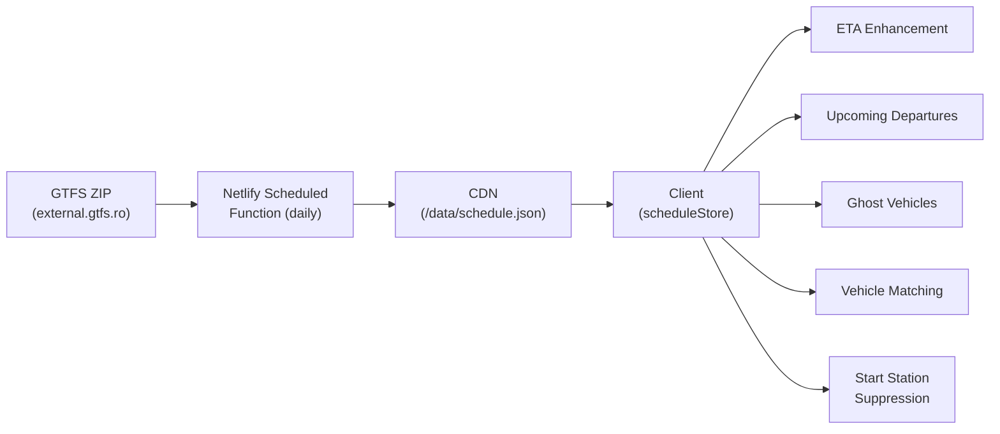
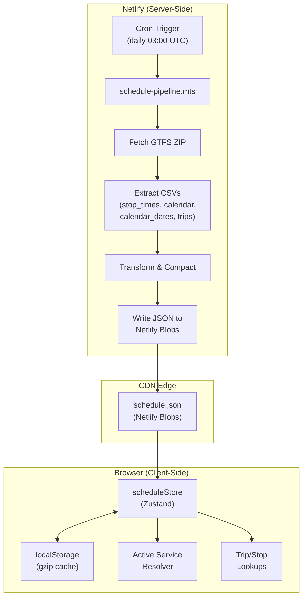

# Design Document: GTFS Schedule Integration

## Overview

This feature adds static GTFS schedule data to Neary's existing real-time GPS tracking, providing scheduled arrival/departure times, upcoming departures, ghost vehicle detection, and duplicate vehicle filtering. The architecture follows a **pre-processing pipeline** pattern: a Netlify scheduled function fetches and compacts the GTFS feed into a small JSON file served from CDN, which the client caches in localStorage (gzip-compressed) and uses as an enhancement layer over the existing Tranzy API flow.

**Key design principle**: Schedule data is strictly additive. All existing GPS-based functionality continues working when schedule data is unavailable or loading.

### Data Flow Summary



## Architecture

### System Architecture

The integration introduces two new components:

1. **Server-side**: A Netlify scheduled function (`netlify/functions/schedule-pipeline.mts`) that runs daily
2. **Client-side**: A `scheduleStore` (Zustand + compressed-localStorage persistence) that fetches, caches, and exposes schedule data



### Integration with Existing Architecture

The schedule store sits alongside existing stores without modifying them:

- **vehicleStore** — unchanged, continues providing `EnhancedVehicleData`
- **tripStore** — unchanged, provides `TranzyTripResponse` with `trip_id` → `route_id` mapping
- **stopTimeStore** — unchanged, provides stop sequence data (no clock times)
- **scheduleStore** (new) — provides clock times, calendar data, active service resolution

Consumer utilities (arrival calculations, vehicle enhancement) read from both stores to combine GPS + schedule data.

## Components and Interfaces

### Server-Side: Schedule Pipeline

**File**: `netlify/functions/schedule-pipeline.mts`

```typescript
// Netlify scheduled function configuration
export const config = {
  schedule: "@daily" // Runs once per day (configurable via env)
};

export default async function handler(): Promise<Response> {
  // 1. Fetch ZIP from GTFS source
  // 2. Extract relevant CSV files in-memory
  // 3. Parse and compact into SchedulePayload
  // 4. Write to Netlify Blobs store
  // 5. Return success/failure status
}
```

**Processing steps**:
1. `fetch()` the ZIP from `https://external.gtfs.ro/cluj/CLUJ.zip`
2. Use a lightweight ZIP library (e.g., `fflate`) to decompress in-memory
3. Parse CSV files: `stop_times.txt`, `calendar.txt`, `calendar_dates.txt`, `trips.txt`
4. Transform times to minutes-since-midnight integers
5. Key stop times by `trip_id` for O(1) client lookup
6. Write the compact JSON to Netlify Blobs (served at `/data/schedule.json`)
7. On failure: log error, retain previous blob (Netlify Blobs are immutable until overwritten)

### Client-Side: Schedule Store

**File**: `src/stores/scheduleStore.ts`

```typescript
interface ScheduleStore {
  // Data
  scheduleData: SchedulePayload | null;
  activeServiceIds: Set<string>;
  
  // State
  loading: boolean;
  error: string | null;
  lastUpdated: number | null;
  dataVersion: string | null;
  
  // Actions
  loadSchedule: () => Promise<void>;
  getStopTimesForTrip: (tripId: string) => ScheduleStopTime[] | null;
  getScheduledArrival: (tripId: string, stopId: number) => number | null; // minutes-since-midnight
  getScheduledDeparture: (tripId: string, stopId: number) => number | null;
  getUpcomingDepartures: (stopId: number, routeIds: number[], windowMinutes?: number) => UpcomingDeparture[];
  isTripActiveToday: (tripId: string) => boolean;
  getTripStartTime: (tripId: string) => number | null; // minutes-since-midnight
  
  // Freshness
  isDataFresh: () => boolean;
}
```

### Client-Side: Schedule Utilities

**File**: `src/utils/schedule/scheduleUtils.ts`

Core pure functions for schedule calculations:

```typescript
// Active service resolution
function resolveActiveServices(calendar: CalendarEntry[], exceptions: CalendarException[], date: Date): Set<string>;

// Time helpers
function minutesSinceMidnight(date: Date): number;
function isTimeInWindow(scheduledMinutes: number, currentMinutes: number, windowMinutes: number): boolean;

// Ghost vehicle detection
function identifyGhostTrips(activeTrips: string[], gpsVehicleTripIds: Set<string>, scheduleData: SchedulePayload, currentMinutes: number): GhostVehicleCandidate[];

// Vehicle-to-schedule matching
function matchVehiclesToSchedule(vehicles: EnhancedVehicleData[], activeTrips: string[], scheduleData: SchedulePayload, currentMinutes: number): VehicleMatchResult[];
```

**File**: `src/utils/schedule/startStationUtils.ts`

```typescript
// Start station suppression logic
function shouldSuppressPrediction(vehicle: EnhancedVehicleData, scheduleData: SchedulePayload, tripStopTimes: TranzyStopTimeResponse[], stops: TranzyStopResponse[], currentMinutes: number): boolean;
```

### Shared Types

**File**: `src/types/schedule.ts`

```typescript
/** The complete schedule payload served from CDN */
interface SchedulePayload {
  version: string; // ISO timestamp of last processing
  stopTimes: Record<string, ScheduleStopTime[]>; // keyed by trip_id
  calendar: CalendarEntry[];
  calendarExceptions: CalendarException[];
  tripServiceMap: Record<string, string>; // trip_id → service_id
}

/** A single stop time within a trip */
interface ScheduleStopTime {
  s: number;  // stop_id
  q: number;  // stop_sequence
  a: number;  // arrival_time (minutes since midnight)
  d: number;  // departure_time (minutes since midnight)
}

/** Calendar entry from calendar.txt */
interface CalendarEntry {
  serviceId: string;
  monday: boolean;
  tuesday: boolean;
  wednesday: boolean;
  thursday: boolean;
  friday: boolean;
  saturday: boolean;
  sunday: boolean;
  startDate: string; // YYYYMMDD
  endDate: string;   // YYYYMMDD
}

/** Calendar exception from calendar_dates.txt */
interface CalendarException {
  serviceId: string;
  date: string;       // YYYYMMDD
  exceptionType: 1 | 2; // 1=added, 2=removed
}

/** Upcoming departure for station display */
interface UpcomingDeparture {
  tripId: string;
  routeId: number;
  departureMinutes: number; // minutes since midnight
  minutesUntil: number;     // relative to now
  hasGpsVehicle: boolean;
  isGhost: boolean;
}

/** Ghost vehicle candidate */
interface GhostVehicleCandidate {
  tripId: string;
  routeId: number;
  scheduledStartMinutes: number;
  elapsedMinutes: number;
  estimatedProgress: number; // 0-1 fraction along route
}

/** Vehicle-to-schedule match result */
interface VehicleMatchResult {
  vehicleId: number;
  tripId: string;
  matchConfidence: 'high' | 'medium' | 'low';
  isSuspectDuplicate: boolean;
  timingDeltaMinutes: number; // difference from expected schedule position
}
```

## Data Models

### Compact JSON Format (pattern-deduplicated)

The CDN payload deduplicates stop-time sequences. Real measurement on the Cluj
feed: **14,755 trips collapse to 194 unique relative patterns (98.7%
redundant)** — the same route pattern runs many times a day differing only by
start time. Storing each pattern once + a per-trip reference cut the payload
from 7.22 MB raw / 1.13 MB gz to **718 KB raw / 116 KB gz** (well under the
500 KB budget, Req 2.1).

Format (`CompactSchedulePayload`):
- `patterns`: array of unique stop-time sequences; each stop's `a`/`d` are
  **offsets in minutes from the trip's first-stop departure** (not absolute).
- `trips`: `trip_id → { p: patternIndex, t: startMinutes, s: serviceId }`.
- `calendar`, `calendarExceptions`, `version` as before.

```json
{
  "version": "2025-01-15T03:00:00Z",
  "patterns": [
    [
      { "s": 4521, "q": 0, "a": 0, "d": 0 },
      { "s": 4522, "q": 1, "a": 3, "d": 3 },
      { "s": 4523, "q": 2, "a": 7, "d": 8 }
    ]
  ],
  "trips": {
    "CJ1001_1_LV_0501": { "p": 0, "t": 305, "s": "LV" }
  },
  "calendar": [
    {
      "serviceId": "LV",
      "monday": true, "tuesday": true, "wednesday": true,
      "thursday": true, "friday": true, "saturday": false, "sunday": false,
      "startDate": "20251101", "endDate": "20260630"
    }
  ],
  "calendarExceptions": []
}
```

**Client expansion**: `expandSchedule()` (in `schedulePayloadCodec.ts`) rebuilds
the queryable `SchedulePayload` (absolute minutes-since-midnight) in memory:
`stopTime.a = pattern[i].a + trip.t`. The pipeline runs `compactifySchedule()`;
the store persists the compact form to localStorage and expands on
load/hydration, keeping both the download and the cache footprint small.
`calendar.txt`/`calendar_dates.txt` are treated as optional (the Cluj feed ships
no `calendar_dates.txt`).

### Client Persistence (compressed localStorage)

The payload is persisted via Zustand `persist` using the shared
`createCompressedStorage` adapter (`src/utils/core/compressedStorage.ts`),
which gzip-compresses through `compressionUtils` before writing to localStorage
— the same mechanism used by other large stores (e.g. `shapeStore`).

| Persist key | Backing store | Encoding |
|-------------|---------------|----------|
| `schedule-store` | localStorage | gzip (`gzip:` prefix) via `compressData`/`decompressData` |

The compact payload (~200-300 KB gzipped) fits comfortably within the
localStorage quota. A single persist key keeps cache management simple — no
versioned migrations or multi-record queries.

> **Resolution (issue #29):** An earlier implementation introduced a separate
> IndexedDB adapter; it was removed in favor of this shared compressed-localStorage
> adapter so all large stores use one consistent persistence mechanism.

### Minutes-Since-Midnight Encoding

Times in GTFS `stop_times.txt` use `HH:MM:SS` format (can exceed 24:00 for overnight trips). The pipeline converts to integers:

- `"05:05:00"` → `305` (5 × 60 + 5)
- `"23:59:00"` → `1439`
- `"25:30:00"` → `1530` (overnight trip, past midnight)

This enables simple arithmetic comparisons on the client without string parsing.

## Correctness Properties

*A property is a characteristic or behavior that should hold true across all valid executions of a system — essentially, a formal statement about what the system should do. Properties serve as the bridge between human-readable specifications and machine-verifiable correctness guarantees.*

### Property 1: Pipeline transformation completeness

*For any* valid GTFS CSV input (stop_times.txt, calendar.txt, calendar_dates.txt, trips.txt), the pipeline transformation SHALL produce a JSON payload that is keyed by trip_id, contains all stop times for every trip, includes all calendar entries with service_id/weekdays/date ranges, includes all calendar exceptions with service_id/date/type, and includes the trip-to-service mapping for every trip.

**Validates: Requirements 1.2, 1.3, 2.2, 2.4, 2.5**

### Property 2: Time encoding round-trip

*For any* valid GTFS time string (HH:MM:SS format, including values ≥ 24:00:00 for overnight trips), encoding to minutes-since-midnight and then converting back to hours and minutes SHALL preserve the original hour and minute values exactly.

**Validates: Requirements 2.3**

### Property 3: Cache freshness and version logic

*For any* schedule store state with cached data, the store SHALL skip fetching when the cache is less than 24 hours old AND the version matches the CDN version. The store SHALL fetch when either the cache is ≥ 24 hours old OR the CDN reports a different version timestamp.

**Validates: Requirements 3.3, 3.6**

> **Known limitation (issue #26):** As implemented, freshness is purely TTL-based (24h). The store does not probe the CDN version while the cache is still fresh, so a version difference does not trigger a refetch until the TTL expires. Req 3.6 is only satisfied on fetch (the fetched version replaces the cached one). A lightweight version/ETag probe is tracked separately.

### Property 4: Active service resolution

*For any* date, set of calendar entries (with weekday flags and date ranges), and set of calendar exceptions, the active service resolver SHALL return exactly the set of service_ids where: the date falls within the entry's start/end range AND the entry's weekday flag is true for that day, PLUS any service_ids with exception_type=1 for that date, MINUS any service_ids with exception_type=2 for that date. A trip SHALL be considered active if and only if its service_id (via tripServiceMap) is in this active set.

**Validates: Requirements 4.1, 4.2, 4.3**

### Property 5: ETA source selection

*For any* vehicle with a known trip_id, the ETA calculation SHALL: (a) when GPS data is fresh and scheduled arrival exists, use GPS-based ETA as primary with schedule as reference; (b) when GPS data exceeds GPS_DATA_AGE_THRESHOLDS, use scheduled arrival as primary with lower confidence; (c) when trip_id is not in schedule data, return existing GPS-based ETA unchanged. In all cases, schedule-based primary ETA SHALL have strictly lower confidence than GPS-based primary ETA.

**Validates: Requirements 5.1, 5.2, 5.3, 5.4, 5.5**

### Property 6: Upcoming departures query

*For any* station with active routes and any current time, the upcoming departures query SHALL return all scheduled departures from that station within the next 60 minutes across all active trips serving that station, sorted by departure time ascending. Each departure SHALL indicate whether a GPS vehicle is assigned or whether it is schedule-only.

**Validates: Requirements 6.1, 6.2, 6.4, 6.5**

> **Pending revision (issue #28):** The fixed 60-minute window is too restrictive for start stations. The query will be extended so a station with no in-window departures still surfaces the next scheduled departure beyond the window, rendered with schedule-styled ETA.

### Property 7: Ghost vehicle lifecycle

*For any* active trip whose scheduled start time from its first stop is in the past AND whose scheduled end time has NOT passed AND which has no GPS-visible vehicle assigned, the system SHALL identify it as a ghost vehicle candidate. The estimated progress along the route SHALL be proportional to elapsed time since start relative to total trip duration, bounded within [0, 1]. Once the scheduled end time passes, the ghost candidate SHALL be removed.

**Validates: Requirements 7.1, 7.2, 7.5**

### Property 8: Vehicle-to-schedule matching

*For any* set of GPS-visible vehicles on a route and set of active scheduled trips on that route, the matching algorithm SHALL assign each vehicle to the scheduled trip whose expected position (based on elapsed time since departure) is closest to the vehicle's actual position, provided the timing difference is within ±10 minutes. When multiple GPS vehicles exist for a single scheduled trip, the best-matching vehicle is considered real. Any vehicle that cannot be matched to any trip within tolerance SHALL be flagged as a suspect duplicate with reduced confidence.

**Validates: Requirements 8.1, 8.2, 8.3, 8.4**

> **Pending revision (issue #24):** On high-frequency routes (scheduled headway < ~10 min near the current time), the ±10 minute tolerance makes duplicate detection unreliable. Suspect-duplicate flagging will be skipped entirely for such routes; flagging remains for low-frequency routes.

### Property 9: Start station prediction suppression

*For any* vehicle, prediction suppression SHALL activate if and only if ALL of: (a) the vehicle's stop_sequence equals the first stop in its trip, (b) the vehicle is within proximity threshold of the first stop's coordinates, (c) the current time is before the scheduled departure from that stop, (d) schedule data exists for the trip. When any condition is not met, normal position prediction SHALL apply.

**Validates: Requirements 6.3, 9.1, 9.2, 9.3, 9.4**

### Property 10: Graceful degradation

*For any* vehicle, station, or trip input, when schedule data is null or unavailable, all schedule-consuming functions SHALL produce output identical to the existing non-schedule behavior: no ghost vehicles, no duplicate detection, no prediction suppression, and GPS-only ETA.

**Validates: Requirements 10.2**


## Error Handling

### Server-Side (Schedule Pipeline)

| Failure | Behavior | Recovery |
|---------|----------|----------|
| GTFS ZIP fetch fails (network/timeout) | Log error, return failure response | Previous blob remains on CDN unchanged |
| ZIP extraction fails (corrupt archive) | Log error, skip processing | Previous blob remains valid |
| CSV parsing fails (malformed data) | Log error for specific file, skip | Partial data NOT written — all-or-nothing |
| Netlify Blob write fails | Log error | Function retries on next daily trigger |
| ZIP exceeds expected size (>50 MB) | Abort processing, log warning | Prevents memory exhaustion in serverless environment |

**Design decision**: The pipeline uses an all-or-nothing write strategy. A partial or corrupt JSON is never written to the blob store. The previous valid version remains available until a full successful processing completes.

### Client-Side (Schedule Store)

| Failure | Behavior | User Impact |
|---------|----------|-------------|
| CDN fetch fails, cache exists (<24h) | Use cached data, set `reducedFreshness` flag | No visible impact, subtle freshness indicator |
| CDN fetch fails, cache stale (>24h) | Use stale cache, set warning | Schedule features work but may be outdated |
| CDN fetch fails, no cache | Set `error` state, `scheduleData = null` | Schedule features disabled, GPS-only mode |
| localStorage write fails (quota/unavailable) | In-memory only (no offline persistence) | App works normally, loses offline capability |
| localStorage read/decompress fails | Fetch from CDN (ignore cache) | Slightly slower initial load |
| Malformed JSON from CDN | Treat as fetch failure | Falls through to cache/error path |
| Schedule data missing for specific trip | Functions return `null`, consumers use GPS fallback | Individual trip has no schedule enhancement |

**Design decision**: The store never throws errors to consumers. All public methods (`getScheduledArrival`, `isTripActiveToday`, etc.) return `null` or empty arrays when data is unavailable, allowing consumers to implement their own fallback logic without try/catch blocks.

### Cross-Cutting Error Principles

1. **No cascading failures**: Schedule store errors never affect vehicleStore, tripStore, or other existing stores
2. **Null propagation**: Missing schedule data propagates as `null` through the utility chain, triggering GPS-only fallbacks at each consumer
3. **Silent degradation**: Users see GPS-based behavior (the current baseline) — schedule is additive-only
4. **Logging**: All schedule errors logged with `[ScheduleStore]` prefix for debugging without user-facing noise

## Testing Strategy

### Property-Based Tests (fast-check)

Each correctness property maps to a property-based test with minimum 100 iterations. The project already includes `fast-check` as a dev dependency.

| Property | Test File | What varies |
|----------|-----------|-------------|
| P1: Pipeline transformation | `src/utils/schedule/pipelineTransform.property.test.ts` | Random CSV rows, trip counts, stop counts |
| P2: Time encoding | `src/utils/schedule/timeEncoding.property.test.ts` | Random hours (0-48), minutes (0-59) |
| P3: Cache freshness | `src/stores/scheduleStore.property.test.ts` | Random timestamps, version strings |
| P4: Active service resolution | `src/utils/schedule/activeService.property.test.ts` | Random dates, calendar entries, exceptions |
| P5: ETA source selection | `src/utils/schedule/etaSource.property.test.ts` | Random GPS ages, schedule availability |
| P6: Upcoming departures | `src/utils/schedule/departures.property.test.ts` | Random stations, times, trip sets |
| P7: Ghost vehicle lifecycle | `src/utils/schedule/ghostVehicle.property.test.ts` | Random trip times, elapsed durations |
| P8: Vehicle matching | `src/utils/schedule/vehicleMatching.property.test.ts` | Random positions, trip counts, timing offsets |
| P9: Start station suppression | `src/utils/schedule/startStation.property.test.ts` | Random positions, times, stop sequences |
| P10: Graceful degradation | `src/utils/schedule/degradation.property.test.ts` | Random inputs with null schedule |

**Tag format**: Each test includes a comment:
```typescript
// Feature: gtfs-schedule-integration, Property 4: Active service resolution
```

### Unit Tests (example-based)

| Scenario | Test Focus |
|----------|------------|
| Fetch failure with existing cache | Store returns cached data and sets reducedFreshness |
| Fetch failure without cache | Store sets error state, schedule features disabled |
| Midnight date crossing | Active services recalculated |
| GPS vehicle replaces ghost | Ghost removed from candidates |
| Schedule unavailable → no matching | All vehicles displayed without duplicate flags |
| Version mismatch triggers refresh | Cache replaced with new CDN version |
| Pipeline fetch failure | Previous blob retained |

### Integration Tests

| Area | Scope |
|------|-------|
| Pipeline end-to-end | Fetch ZIP → parse CSV → produce valid JSON (with mock GTFS data) |
| Persistence reload | Compressed localStorage persist → reload cycle |
| Schedule + arrival service | ETA calculation uses schedule fallback correctly |

### Bundle Size Check

A build-time assertion verifies that schedule-related code chunks do not exceed 50 KB (excluding the CDN-served JSON payload). This can be verified with Vite's `rollup-plugin-visualizer` or a custom build script.

### Test Configuration

- **Runner**: Vitest (existing project setup)
- **PBT library**: fast-check (already in devDependencies)
- **Iterations**: Minimum 100 per property test
- **Timeout**: 60 seconds per test (per project convention)
- **Coverage target**: All `src/utils/schedule/` files at ≥90% branch coverage

## Known Deviations & Pending Revisions

This section tracks accepted changes and known gaps surfaced after the initial
implementation, so the spec stays aligned with intended behavior (no drift).
Each item is tracked as a GitHub issue and will be folded into the relevant
requirement/design section when implemented.

| Area | Deviation / change | Issue |
|------|--------------------|-------|
| Upcoming departures (Req 6.2, Property 6, task 7.3) | Show the next scheduled departure beyond the 60-min window for start stations / when none are in-window, with schedule-styled ETA | #28 |
| Vehicle matching (Req 8, Property 8) | Skip suspect-duplicate flagging on high-frequency routes (headway < ~10 min) | #24 |
| Cache freshness (Req 3.6, Property 3) | Version-mismatch refetch while cache is fresh is not implemented (TTL-only); add a lightweight version probe | #26 |
| Persistence (design Client Persistence) | RESOLVED — removed the bespoke IndexedDB adapter; schedule store now uses the shared `createCompressedStorage` (compressed localStorage) like other large stores | #29 |

### Related future work (separate specs, not part of this feature)

| Area | Description | Issue |
|------|-------------|-------|
| Data source architecture | Server-side Tranzy fetch + cache so clients are keyless; rotating secret keys; secrets only in env, never in git | #19 |
| Observability | Freshness/age indicators (server→Tranzy fetch, client→server fetch, GPS age) with red stale threshold | #20 |
| Schedule display surface | Favorites: tap a vehicle to view its offline schedule (arrivals/departures) in a table | #22 |
