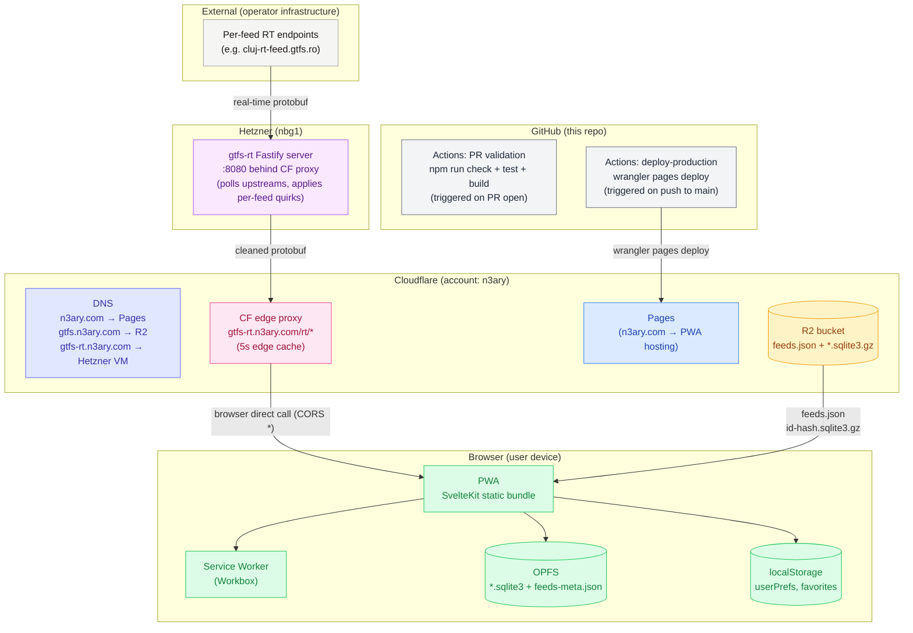

# Infrastructure

Every cloud / external / browser piece the app touches, in one diagram + one table. Cross-references the relevant specs/concepts for detail; this doc is the **index** for "what runs where and what breaks if it dies".

Cross-refs:
- Tech stack table — [stack.md](stack.md)
- Data flow (R2 → app → reconciler) — [data-pipeline.md](data-pipeline.md)
- CI / versioning / deploy — [ci-and-versioning.md](../specs/ci-and-versioning.md)
- PWA specifics (version polling, cache headers, safe-area) — [pwa.md](../specs/pwa.md)
- Storage lifecycle (OPFS eviction, pinning, offline) — [multi-feed-data-lifecycle.md](../specs/multi-feed-data-lifecycle.md)

## Diagram

## Component table

| Component | Role | Owner | Cost driver | Failure impact |
|---|---|---|---|---|
| **GitHub Actions — PR validation** | `npm run check` + `npm test` + `npm run build` on every PR (also auto-bumps `package.json#version` on the PR branch) | GitHub | Free tier (2 000 min/month) | PR can't merge |
| **GitHub Actions — deploy-production** | `wrangler pages deploy build --project-name=app --branch=main` on push to `main` | GitHub + Cloudflare | Free tier + Wrangler invocation | Latest commits not live in production |
| **Cloudflare Pages** | Static hosting for the PWA (`build/`) | Cloudflare | Free tier (unlimited requests) | PWA down |
| **Cloudflare R2** — `gtfs` bucket | Stores `feeds.json` + `<id>-<hash12>.sqlite3.gz`. Populated by the sister `gtfs` repo's daily pipeline; consumed via `gtfs.n3ary.com` | Cloudflare | $0.015/GB/month + $0.36/M Class A operations | App can't bootstrap (no manifest, no blobs) |
| **Cloudflare DNS** — `n3ary.com` → Pages, `gtfs.n3ary.com` → R2, `gtfs-rt.n3ary.com` → Hetzner VM | Custom-domain routing for the app, the data, and the realtime proxy | Cloudflare | Free with Pages + R2 | App/data/realtime URLs down |
| **Cloudflare edge proxy** — `gtfs-rt.n3ary.com/rt/*` | 5s edge cache in front of the Hetzner VM | Cloudflare | Free with the Cache Rule | VM cold-start adds latency; no data loss |
| **Hetzner CX23 (nbg1)** — `@gtfs/rt` Fastify server | Polls each feed's `realtime.vehicle_positions` URL, applies per-feed adapter quirks, validates against the spec, serves cleaned protobuf at `/rt/<feed>/vehicle_positions` | n3ary (this org) | €5.49/month (CX23) | Live RT offline (UI shows schedule-only data) |
| **Per-feed RT endpoints** (e.g. `cluj-rt-feed.gtfs.ro`) | Live protobuf per operator; polled by the Hetzner server | Operators | Free | Live view falls back to schedule-only for that feed |
| **Browser — PWA bundle** | The actual app | User device | Free | — |
| **Browser — Service Worker** (Workbox) | Asset caching + `_app/version.json` polling | User device | Free | PWA may serve stale assets after a deploy |
| **Browser — OPFS** | `feeds-meta.json` + per-feed `*.sqlite3` blobs | User device | Free | App can't load feeds (forces re-download on next launch) |
| **Browser — localStorage** | `userPrefs` (theme, feedId, toggles) + `favorites` per-feed | User device | Free | App may not remember settings between sessions |

The Hetzner RT adapter shipped in
[n3ary/gtfs-publisher](https://github.com/n3ary/gtfs-publisher) —
the per-feed quirks that used to live inline in the app via the
TEMP `recoverClujTripFields` block in
`src/lib/domain/enrichObservations.ts` moved to the producer side
(`@n3ary/gtfs-adapter-cluj-napoca/rt`) so the app no longer needs
feed-specific fallbacks.