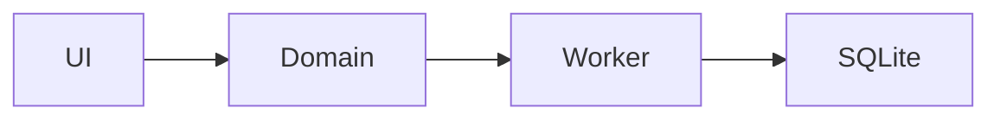

<!-- synced from n3ary/standards@f478439 on 2026-07-06 -->
<!-- do not edit locally; run scripts/vendor-standards.mjs to update -->

# Diagramming and admonitions

Visual conventions for docs in this repo.

## Diagrams

> [!IMPORTANT]
> Use Mermaid for every diagram. No ASCII art, no PNG/SVG attachments.

Reasons:

- Mermaid is plain text — diffs in PRs are reviewable.
- It renders directly in GitHub and most modern viewers.
- It doesn't drift from the surrounding doc the way an image does.

Example:

````markdown

````

### Where to put diagrams

- **Inline** in the doc that needs it (most cases).
- **Dedicated file** under [../architecture/](../architecture/) only when the
  same diagram is referenced by 2+ docs.

### When ASCII boxes are still OK

Short layered overviews (4–6 boxes, no interconnections) are clearer as ASCII
in a code block than as a Mermaid render. See
[../architecture/system-overview.md](../architecture/system-overview.md)
for an example. Anything more complex → Mermaid.

> [!CAUTION]
> Don't paste PNG screenshots of architecture diagrams. They go stale
> immediately and you can't grep them.

## Admonitions

Use GitHub-Flavored-Markdown admonitions to visually flag important
content. GFM supports five natively:

| Syntax | When to use |
|---|---|
| `> [!NOTE]` | Informational aside the reader should be aware of |
| `> [!TIP]` | Helpful suggestion, optional to follow |
| `> [!IMPORTANT]` | Reader must internalize this to use the feature correctly |
| `> [!WARNING]` | Risk / caveat — using this wrong has consequences |
| `> [!CAUTION]` | **Anti-pattern flag** — do not do this |

### Convention

- `[!CAUTION]` is reserved for **anti-patterns** in this repo. If you see it,
  the line below is "do not do X".
- `[!IMPORTANT]` and `[!WARNING]` are for things the reader must read.
- `[!NOTE]` and `[!TIP]` are for things they may skip.

### Examples

```markdown
> [!NOTE]
> The reconciler uses bipartite matching, not first-come — see
> [live-data-pipeline.md](../specs/live-data-pipeline.md).

> [!TIP]
> When debugging schedule math, log `nowMinSinceMidnightInTz(feed.timezone)`
> and compare to `scheduledArrival`.

> [!IMPORTANT]
> Every wall-clock comparison uses the **feed's** timezone, never the system's.

> [!WARNING]
> Mutating `userPrefs.feedId` triggers a worker `setFeed` round-trip that
> closes the active SQLite handle. Don't call it on every render.

> [!CAUTION]
> Don't read `Date.now()` directly in domain code. Pass `nowMs` in.
```

### Rules

> [!IMPORTANT]
> One admonition per topic, max one or two per doc. They lose meaning at scale.

- Keep the body to 1–3 lines.
- Don't nest admonitions.
- Don't decorate every paragraph — they should stand out.

## What does NOT belong in a doc

- Emoji-as-decoration (✅ ❌ 🚀 ⚡). Use admonitions instead.
- Decorative horizontal rules `***`.
- "Last updated" timestamps in the body — that's what git is for.
